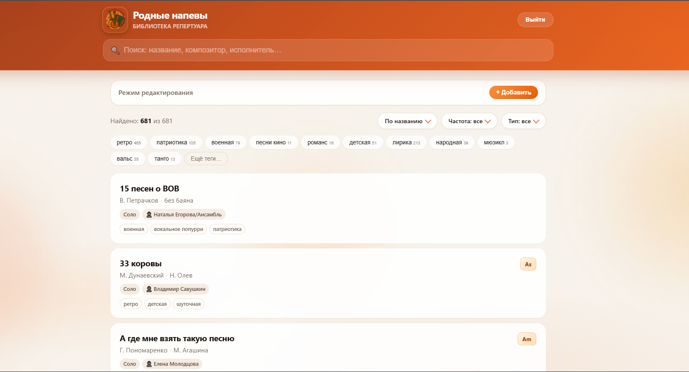
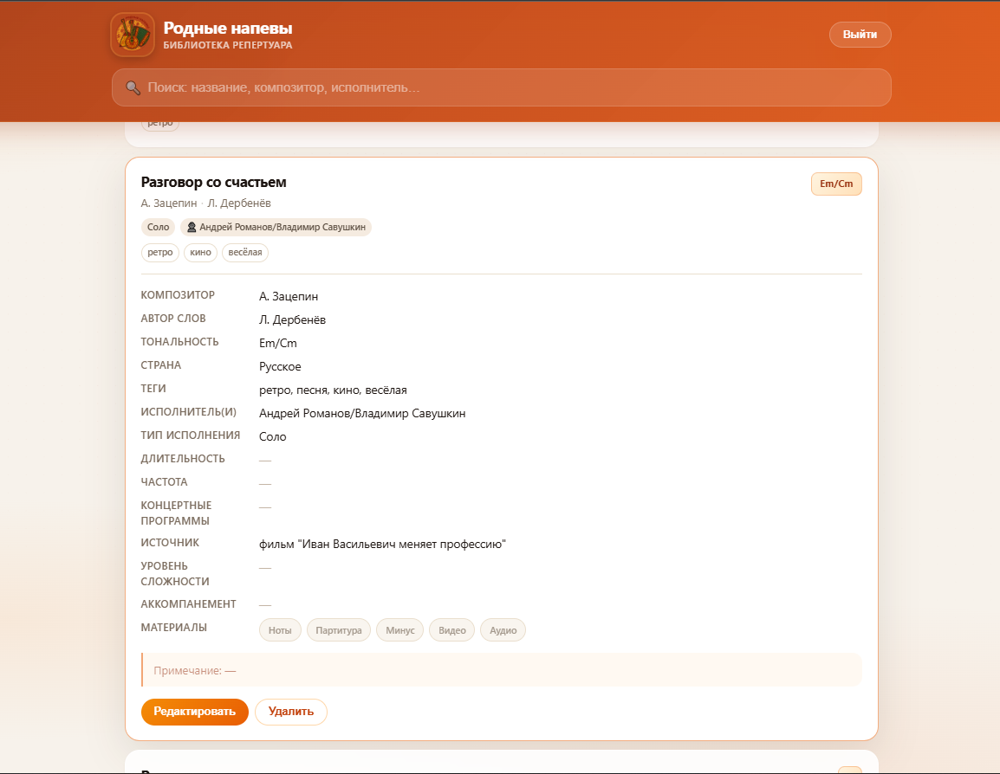
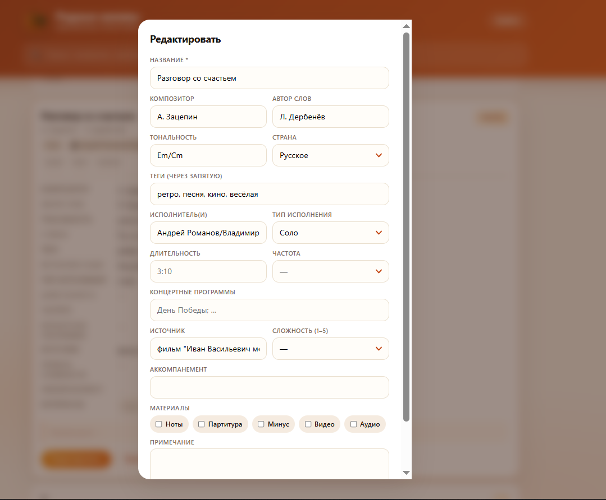
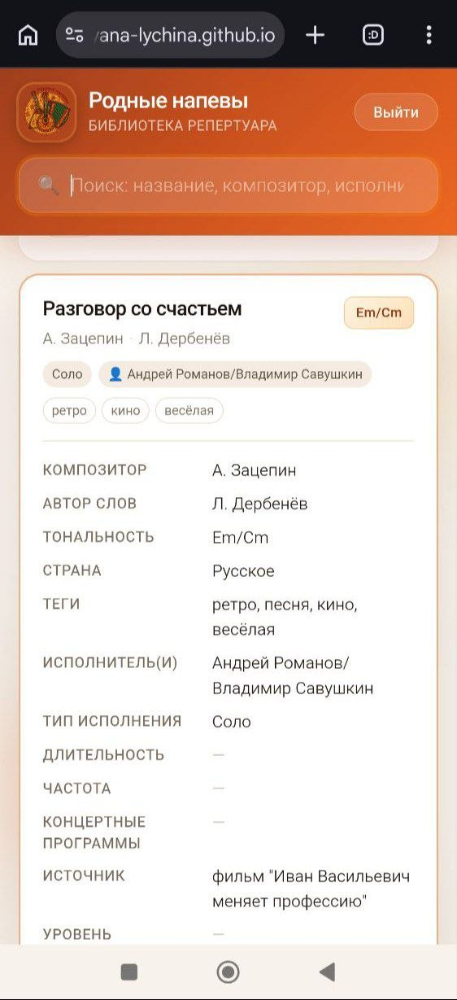

# Электронная картотека репертуара  
### Digital Repertoire Catalog for Vocal Ensembles

Веб-приложение для учёта и поиска концертного репертуара вокального / эстрадно-фольклорного коллектива.  
Разработано для ансамбля **«Родные напевы»** и может масштабироваться на другие творческие коллективы учреждений культуры (филармонии, дворцы культуры, концертные организации).

**Статус:** в эксплуатации · 680+ произведений · используется ансамблем  
**Демо:** _https://github.com/ulyana-lychina/rodnye-napevy_  
**Лицензия данных:** данные репертуара принадлежат коллективу / учреждению

---

## Проблема

Репертуар коллектива обычно ведётся в разрозненных списках: бумажные тетради, переписки в мессенджерах и т.п. Из-за этого:

- сложно быстро найти произведение по тональности, тегу, исполнителю или программе;
- нет единого актуального списка «что у нас в работе»;
- сложно передать базу новому концертмейстеру или руководителю.

**Задача проекта** — собрать репертуар в одну электронную картотеку с поиском, фильтрами и доступом с компьютера и телефона.

---

## Решение

Одностраничное веб-приложение (SPA) с облачной базой:

| Для артистов и руководства | Для редакторов (руководитель, концертмейстер) |
|----------------------------|------------------------------------------------|
| Поиск и фильтры            | Вход по email / паролю                         |
| Карточки произведений      | Добавление и редактирование                    |
| Работа с телефона          | Удаление, теги, материалы                      |
| Без установки              | Изменения сразу видны всем                     |

---

## Возможности

- **Поиск** по названию, композитору, автору слов, исполнителю, программе, примечанию  
- **Фильтры:** теги, частота исполнения, тип исполнения (соло / дуэт / ансамбль…), в т.ч. «тип не указан»  
- **Сортировка** по названию, композитору (по фамилии), тональности, частоте  
- **Алфавитный отбор** по букве фамилии композитора (при сортировке по композитору)  
- **Карточка произведения:** тональность, страна, исполнители, тип, длительность, концертные программы, источник, сложность, аккомпанемент, наличие нот / партитуры / минуса / видео / аудио, примечание  
- **Адаптивный интерфейс** — удобно на телефоне и на компьютере  
- **Облачное хранение** (Firebase) — одна актуальная база для всех  

_Планируется:_ ссылки на файлы нот и минусовок (Яндекс.Диск / Storage), роли доступа, несколько коллективов в одном аккаунте.

---

## Скриншоты


| Главный экран | Карточка | Редактирование |
|---------------|----------|----------------|
|  |  |  |

*На мобильном:*

| Поиск и фильтры | Открытая карточка |
|-----------------|-------------------|
|  |  |

---

## Технологии

| Слой | Стек |
|------|------|
| Интерфейс | HTML5, CSS3 (адаптив, glassmorphism), vanilla JavaScript |
| Данные | Cloud Firestore (NoSQL) |
| Авторизация | Firebase Authentication (Email / Password) |
| Хостинг | GitHub Pages (статика) |
| Исходные данные | Excel → структурированный каталог → Firestore |

Без тяжёлого фронтенд-фреймворка: быстрая загрузка, простое сопровождение, прозрачная логика.

---

## Структура репозитория

```
├── index.html          # приложение (UI + логика)
├── logo.png            # логотип коллектива
├── README.md           # этот файл
├── docs/
│   └── screenshots/    # скриншоты для README и презентаций
└── (опционально)
    ├── КП_…docx        # коммерческое предложение для учреждений
    └── seed / excel    # исходные выгрузки репертуара
```

---

## Как открыть

**Онлайн (рекомендуется):** ссылка GitHub Pages — см. блок «Демо» выше.

**Локально:** откройте `index.html` в браузере.  
> Редактирование и синхронизация с Firebase на `file://` работают ограниченно — для полной функции используйте Pages.

### Развёртывание на GitHub Pages

1. Репозиторий → **Settings → Pages**  
2. Source: **Deploy from a branch** → `main` → `/ (root)`  
3. Через 1–2 минуты сайт доступен по адресу `https://<user>.github.io/<repo>/`

---

## Роль автора

Проект выполнен как **практический digital-product для музыкального коллектива**:

- анализ задачи учёта репертуара в условиях живого ансамбля;
- проектирование структуры карточки и фильтров;
- реализация веб-интерфейса и облачного хранения;
- внедрение в работу коллектива (наполнение базы, обучение пользователей);
- подготовка материалов для возможного тиражирования в учреждениях культуры.

**Автор:** _Лючина Ульяна Владимировна_ · _ulyanalyuchina@gmail.com / _

---

## Для учреждений культуры

Решение можно адаптировать под другой коллектив или филармонию:

- оформление под фирменный стиль (логотип, цвета);
- перенос существующего репертуара из Excel / Word;
- политика конфиденциальности и доступы для сотрудников;
- при необходимости — файлы нот и минусовок, несколько составов.

Краткое коммерческое предложение — в файле `КП_Электронная_картотека_репертуара.docx` (если приложен к репозиторию) или по запросу.

---

## Статус и roadmap

| Этап | Состояние |
|------|-----------|
| Каталог + поиск + фильтры | ✅ готово |
| Карточки с полным набором полей | ✅ готово |
| Редактирование с авторизацией | ✅ готово |
| Эксплуатация в ансамбле | ✅ идёт (680+ позиций) |
| Ссылки на ноты / минус (Диск) | 🔜 в планах |
| Роли (только просмотр / редактор) | 🔜 |
| Мультиколлектив | 💡 идея |

---

## Конфиденциальность

- В базе хранятся сведения о репертуаре и при необходимости ФИО исполнителей коллектива.  
- Редактирование доступно только по учётной записи.  
- Рекомендуется не публиковать в открытый репозиторий персональные данные третьих лиц сверх необходимого.

---

## Лицензия

Код интерфейса — для нужд коллектива / по договорённости с автором.  
**Данные репертуара** — собственность коллектива «Родные напевы» (или учреждения-заказчика).
